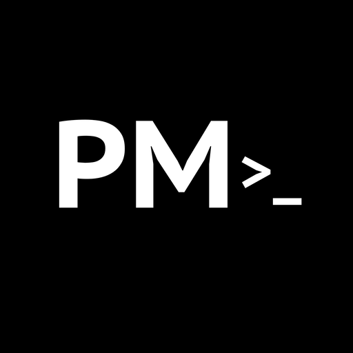

<p align="center">
  
</p>

<h1 align="center">PM Desktop</h1>

<p align="center">
  <strong>A native macOS application for managing development projects</strong>
</p>

<p align="center">
  <a href="https://github.com/mr-tanta/pm-desktop/releases/latest">
    
  </a>
  <a href="https://github.com/mr-tanta/pm-desktop/blob/main/LICENSE">
    
  </a>
  <a href="https://github.com/mr-tanta/pm-desktop/releases">
    
  </a>
  
</p>

<p align="center">
  <a href="#features">Features</a> •
  <a href="#installation">Installation</a> •
  <a href="#usage">Usage</a> •
  <a href="#development">Development</a> •
  <a href="#contributing">Contributing</a>
</p>

---

## Overview

PM Desktop is a lightweight, native desktop application designed for developers who manage multiple projects. Built with performance in mind using Tauri and React, it provides instant access to your projects, git status at a glance, and time tracking capabilities—all from your menu bar.

<p align="center">
  
</p>

## Features

### Project Management
- **Automatic Project Discovery** — Scans your development directories and detects project types (Next.js, React, Vue, Rust, Go, Python, and more)
- **Git Status at a Glance** — See uncommitted changes, branch info, and sync status without opening a terminal
- **Quick Actions** — Open projects in your preferred editor, terminal, or Finder with one click
- **Archive System** — Keep your workspace clean by archiving inactive projects

### Productivity
- **Command Palette** — Press `Cmd+K` to quickly search and open any project
- **System Tray** — Access recent projects and controls from your menu bar
- **Time Tracking** — Built-in timer to track time spent on each project
- **Keyboard Shortcuts** — Navigate entirely with your keyboard

### Performance
- **Native Performance** — Built with Tauri for minimal resource usage (~15MB memory)
- **Async Operations** — Non-blocking file system operations keep the UI responsive
- **Smart Caching** — Git status caching reduces expensive operations
- **Instant Startup** — Opens in under 500ms

## Installation

### Download

Download the latest release from the [Releases](https://github.com/mr-tanta/pm-desktop/releases) page.

- **macOS (Apple Silicon)**: `PM Desktop_x.x.x_aarch64.dmg`
- **macOS (Intel)**: `PM Desktop_x.x.x_x64.dmg`

### Homebrew (Coming Soon)

```bash
brew install --cask pm-desktop
```

### Build from Source

Requirements:
- Node.js 18+
- Rust 1.70+
- pnpm

```bash
# Clone the repository
git clone https://github.com/mr-tanta/pm-desktop.git
cd pm-desktop

# Install dependencies
pnpm install

# Run in development
pnpm tauri dev

# Build for production
pnpm tauri build
```

## Usage

### First Launch

1. Open PM Desktop
2. Go to **Settings** and configure your project directories:
   - **Active Projects**: Where your current projects live (e.g., `~/Developer/active`)
   - **Archive Directory**: Where archived projects are stored (e.g., `~/Developer/archived`)
3. PM Desktop will automatically scan and display your projects

### Keyboard Shortcuts

| Shortcut | Action |
|----------|--------|
| `Cmd + K` | Open command palette |
| `Cmd + ,` | Open settings |
| `Cmd + 1` | Go to Dashboard |
| `Cmd + 2` | Go to Projects |

### Command Palette

Press `Cmd + K` to open the command palette. You can:
- Search projects by name or type
- Open projects in your editor
- Start/stop time tracking
- Archive or restore projects

### System Tray

Click the menu bar icon to:
- Show/hide the main window
- Access recent projects
- Quick start timer for a project

## Architecture

```
pm-desktop/
├── src/                    # React frontend
│   ├── components/         # UI components
│   ├── hooks/              # React hooks
│   ├── stores/             # Zustand state management
│   └── lib/                # Utilities and Tauri bindings
├── src-tauri/              # Rust backend
│   ├── src/
│   │   ├── commands/       # Tauri command handlers
│   │   ├── services/       # Business logic
│   │   └── models/         # Data structures
│   └── Cargo.toml
└── package.json
```

### Tech Stack

| Layer | Technology |
|-------|------------|
| Framework | [Tauri 2](https://tauri.app/) |
| Frontend | [React 19](https://react.dev/) + TypeScript |
| Styling | [Tailwind CSS 4](https://tailwindcss.com/) |
| State | [Zustand](https://zustand-demo.pmnd.rs/) |
| Data Fetching | [TanStack Query](https://tanstack.com/query) |
| Backend | Rust + [Tokio](https://tokio.rs/) |
| Database | SQLite (via rusqlite) |
| Git | [git2](https://github.com/rust-lang/git2-rs) |

## Development

### Prerequisites

- [Node.js](https://nodejs.org/) 18 or later
- [Rust](https://rustup.rs/) 1.70 or later
- [pnpm](https://pnpm.io/) 8 or later

### Setup

```bash
# Install dependencies
pnpm install

# Start development server
pnpm tauri dev
```

### Project Structure

- `src/` — React frontend code
- `src-tauri/` — Rust backend code
- `src-tauri/src/commands/` — IPC command handlers
- `src-tauri/src/services/` — Core business logic

### Building

```bash
# Development build
pnpm tauri dev

# Production build
pnpm tauri build

# Generate app icons from source
pnpm tauri icon path/to/icon.png
```

## Roadmap

- [ ] Windows and Linux support
- [ ] Project templates and scaffolding
- [ ] GitHub integration (issues, PRs)
- [ ] Time tracking reports and statistics
- [ ] Plugin system for extensibility
- [ ] Cloud sync for settings

## Contributing

Contributions are welcome! Please read our [Contributing Guide](CONTRIBUTING.md) before submitting a Pull Request.

1. Fork the repository
2. Create your feature branch (`git checkout -b feature/amazing-feature`)
3. Commit your changes (`git commit -m 'Add amazing feature'`)
4. Push to the branch (`git push origin feature/amazing-feature`)
5. Open a Pull Request

## License

This project is licensed under the MIT License - see the [LICENSE](LICENSE) file for details.

## Acknowledgments

- [Tauri](https://tauri.app/) for the amazing framework
- [Lucide](https://lucide.dev/) for the beautiful icons
- All [contributors](https://github.com/mr-tanta/pm-desktop/graphs/contributors) who help improve this project
